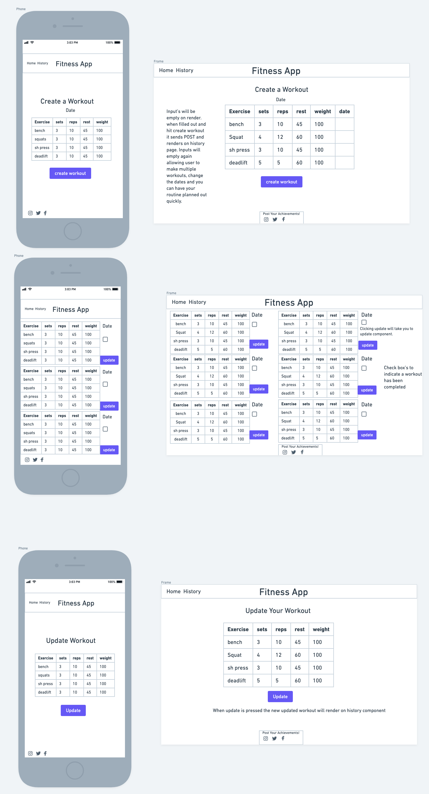
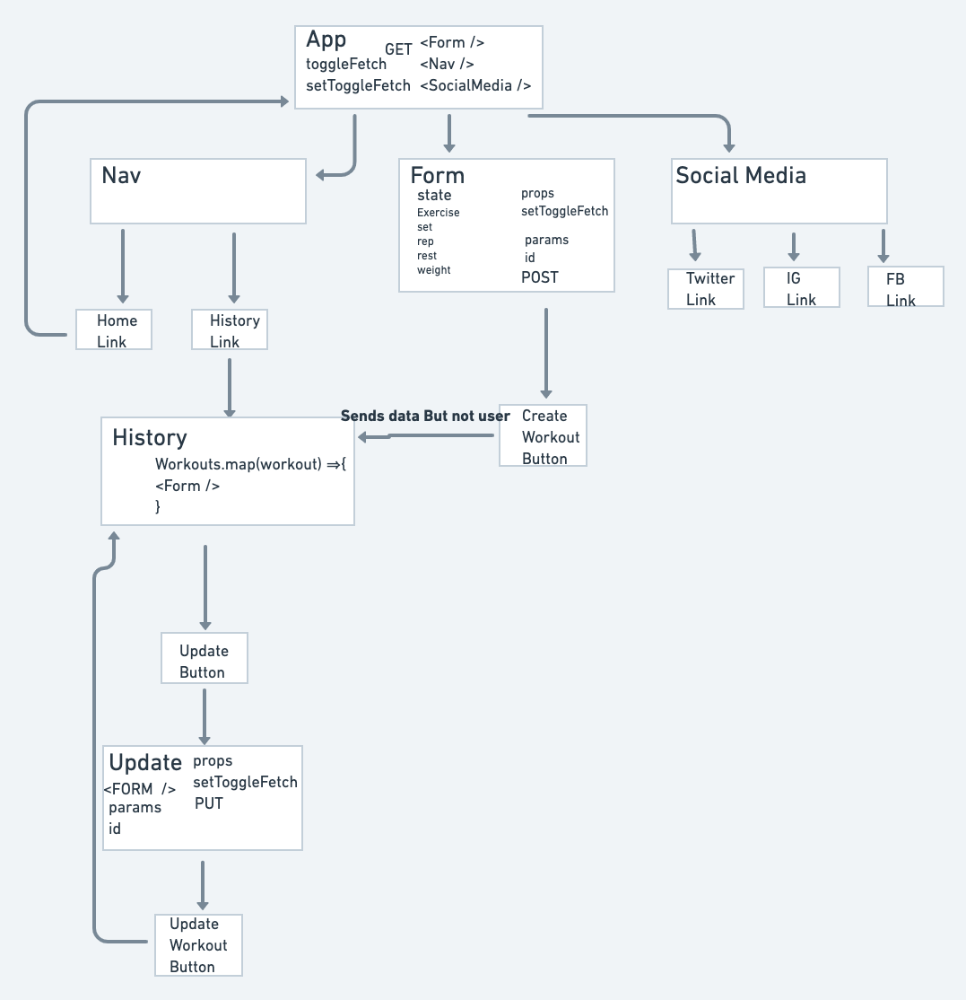

# Project Overview

## Fitness-App

## Project Description

The fitness-app is a simple tool to help users with staying motivated with their fitness routines. One of the worst things a person can do when going to the gym is going without a plan. The fitness-app is a mobile friendly, easy to use way to plan out your workout for the day or week. A history section will be available to show your progress plus upcoming workouts. The history section will also be good for when users are seeking inspiration and wish to switch up their routines a bit.

## Wireframes



## Component Hierarchy



## API and Data Sample

```json
{
  "records": [
    {
      "id": "recTXp14bE7dXvtjX",
      "fields": {
        "exercise": "deadlift",
        "sets": 5,
        "reps": 5,
        "rest(sec)": 60,
        "weight": 100
      },
      "createdTime": "2021-08-19T20:33:26.000Z"
    },
    {
      "id": "recgYT6EBhxDDqYxZ",
      "fields": {
        "exercise": "sh press",
        "sets": 3,
        "reps": 14,
        "rest(sec)": 30,
        "weight": 100
      },
      "createdTime": "2021-08-19T20:27:54.000Z"
    },
    {
      "id": "recnfnoVAcQWIKcHZ",
      "fields": {
        "exercise": "squat",
        "sets": 3,
        "reps": 12,
        "rest(sec)": 60,
        "weight": 100
      },
      "createdTime": "2021-08-19T20:27:54.000Z"
    },
    {
      "id": "recz354y3gqcM1wn4",
      "fields": {
        "exercise": "bench press",
        "sets": 3,
        "reps": 10,
        "rest(sec)": 45,
        "weight": 100
      },
      "createdTime": "2021-08-19T20:27:54.000Z"
    }
  ]
}
```

### MVP/PostMVP

#### MVP

- Users can view, update, and post workouts
- Have all the components rendering correctly
- Mobile Friendly Site
- Style with CSS
- Be a working, interactive React app
- Utilize React Router
- Use Axios to consume data from Airtable, and GET/render that data in your components.
- Use Axios to POST new data on Airtable and History Component
- Use Axios to PUT/ update new data on Airtable and History Component
- Use flexbox (display: flex) or CSS Grid
- Implement responsive design on 2 screen sizes, using a media query

#### PostMVP

- Create in app social media so users can interact and challenge each other to workouts
- Add a Upcoming Component for future workouts that when checked off will be archived in History Component
- Info Component that delves deeper into kinesiology of workingout. Joint movement, Frontal, Lateral, Traverse planes. Emphasis on Joint Balance and proper nutrition. Articles on what workout fads will destroy your body.
- Include a visual representation of human body on form component. As the user inputs exercises the muscles worked will start shading in at green. The more exercises put in that workout that targets those muscle groups the the shading will go from green-yellow-red. Red indicating you are potentially over targeting said muscle group. Input fields will include Joint movement, single or multi joint, muscle groups engaged.
- Warm up and Cool down will be a suggested feature that will take into account muscle groups worked and suggest stretches the user should do when beginning or done with the workout.

## Project Schedule

| Day       | Deliverable                                                        | Status     |
| --------- | ------------------------------------------------------------------ | ---------- |
| Aug 19    | Prompt / Wireframes / Priority Matrix / Timeframes                 | Complete   |
| Aug 20    | Project Approval                                                   | Complete   |
| Aug 21-22 | Core Application Structure/Create Components. Pseudocode Start MVP | Complete   |
| Agu 23    | Continue with MVP Specifically functionality components            | Complete   |
| Aug 24    | Finish MVP                                                         | Complete   |
| Aug 25    | Styling, Test App                                                  | Incomplete |
| Aug 26    | Finalize Styling, ensure app works                                 | Incomplete |
| Aug 27    | Presentations                                                      | Incomplete |

## Timeframes

| Component                  | Priority | Estimated Time | Time Invested | Actual Time |
| -------------------------- | :------: | :------------: | :-----------: | :---------: |
| Working with API           |    H     |      3hrs      |     3hrs      |    3hrs     |
| Add Form                   |    H     |      3hrs      |     2hrs      |    2hrs     |
| Add History                |    H     |      3hrs      |     2hrs      |    2hrs     |
| Add Nav                    |    H     |      3hrs      |     2hrs      |    2hrs     |
| Add Social                 |    H     |      3hrs      |     3hrs      |    3hrs     |
| Add TableRow               |    H     |      3hrs      |      1hr      |    1hrs     |
| Ensure Functionality works |    H     |      3hrs      |     3hrs      |    3hrs     |
| Style Form                 |    H     |      3hrs      |     4hrs      |    4hrs     |
| Style History              |    H     |      3hrs      |     5hrs      |    5hrs     |
| Style Nav                  |    H     |      3hrs      |     3hrs      |    3hrs     |
| Style Social               |    H     |      3hrs      |     2hrs      |    2hrs     |
| Style TableRow             |    H     |      3hrs      |      N/N      |     N/N     |
| Style App                  |    H     |      3hrs      |     3hrs      |    3hrs     |
| Add SignUp                 |    L     |      2hrs      |      1hr      |     1hr     |
| Style SignUp               |    L     |      2hrs      |      1hr      |     1hr     |
| Interactive in-app         |    L     |      5hrs      |     :---:     |             |
| Add Upcoming               |    L     |      3hrs      |     :---:     |             |
| Style Upcoming             |    L     |      3hrs      |     :---:     |             |
| Total                      |          |      54hr      |     35hrs     |    35hrs    |

## SWOT Analysis

### Strengths:

I feel condifent with conditional logic.

### Weaknesses:

React is still brand new to me, having a hard time with knowing what goes where.
CSS is still difficult as well

### Opportunities:

Strenghten React and CSS skills

### Threats:

TBD
